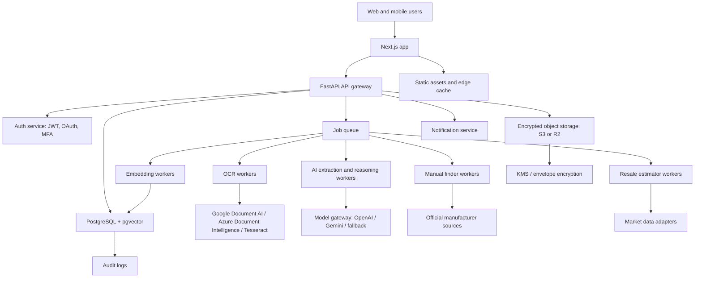
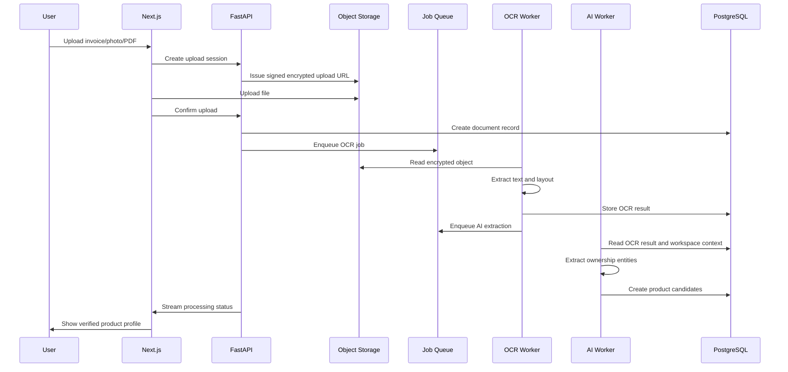
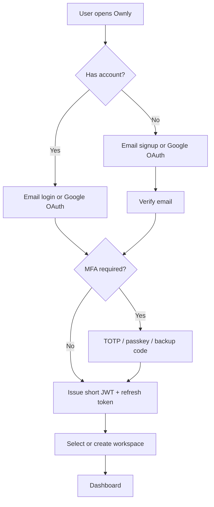

# Ownly Product And Architecture Package

Tagline: Own everything. Find anything.

Ownly is a Personal Ownership Management Platform. It creates a complete digital identity for every physical or digital product a person owns, so users can find invoices, warranties, manuals, repair history, service eligibility, resale value, and household ownership context without digging through email, chats, downloads, paper files, or photo galleries.

## 1. Product Requirements Document

### Vision

Ownly becomes the trusted ownership operating system for individuals, families, and eventually insurers, retailers, repair networks, and resale marketplaces. Every purchased item becomes a living digital asset that can be searched, protected, serviced, transferred, insured, and resold.

### Product Principles

- Zero manual typing for core asset creation.
- Every item has a durable identity, not just a receipt.
- Search should feel like asking a household expert.
- Privacy is a product feature, not a compliance footnote.
- The platform must work globally, with locale-specific taxes, currencies, warranty rules, sellers, and date formats.
- The system should capture uncertainty visibly and ask for confirmation only when confidence is low.

### Primary Users

- Household organizer: tracks purchases, warranties, appliances, documents, and repairs for a family.
- High-value owner: manages electronics, luxury goods, bikes, cameras, instruments, and appliances.
- Frequent online shopper: wants automatic invoice capture from Gmail, Amazon, Flipkart, Apple, and marketplaces.
- Small home business user: manages assets, GST records, repairs, and depreciation-lite reporting.
- Senior family member or caregiver: needs shared access and reminders without technical complexity.

### Core Jobs To Be Done

- When I buy something, create a complete product profile automatically.
- When I need support, find the invoice, serial number, warranty, manual, seller, and service history instantly.
- When a return or warranty is about to expire, warn me in time.
- When I want to sell something, estimate value and generate a listing.
- When my family asks where a document is, let them search naturally.
- When I need to know total household value, spend, or warranties, show it in one dashboard.

### MVP Scope

1. Upload scanner for photos, PDFs, screenshots, and email invoice files.
2. OCR plus AI extraction into structured ownership records.
3. Product profile pages with documents, timeline, warranty, return window, photos, notes, and AI insights.
4. Natural language search over products, documents, metadata, and dates.
5. Warranty and return reminders.
6. Dashboard with inventory value, category mix, warranty status, spending trends, and upcoming actions.
7. Family workspace with owner, admin, member, and viewer roles.
8. Secure authentication with Google login, email/password, JWT sessions, MFA, and audit logs.

### V1 Plus

- Official manual finder.
- Resale estimator and marketplace listing generator.
- Service and repair timeline.
- Gmail import and marketplace invoice detection.
- Bank transaction matching for proof and missing invoice discovery.
- Mobile-first camera capture.

### Non-Goals For MVP

- Full insurance underwriting.
- Full accounting suite.
- Multi-country tax filing.
- Public marketplace.
- Native iOS/Android app before web capture and data model are validated.

### Success Metrics

- Time to create a verified product profile: under 30 seconds after upload.
- Extraction automation rate: at least 85 percent fields filled without manual entry for standard invoices.
- Search success rate: at least 90 percent for known-item queries in user testing.
- Reminder reliability: 99.9 percent scheduled notification execution.
- Weekly active household rate: 35 percent by month 6 after launch.
- Documents attached per product: median of 2 or more by month 3.
- Support event usefulness: 70 percent of service visits start from an Ownly product profile.

### Functional Requirements

#### AI Receipt Scanner

Users can upload photos, PDFs, email invoices, screenshots, and scanned paper receipts. The system extracts:

- Product name
- Brand
- Model
- Serial number
- Purchase date
- Price
- Tax such as GST, VAT, or sales tax
- Seller
- Warranty period
- Return window
- Payment method
- Invoice number
- Order ID
- Line items
- Confidence score per field

The scanner must support multi-item invoices. If one invoice includes a phone, charger, and headphones, Ownly should create separate linked product candidates and preserve the original invoice.

#### Product Profile

Every product gets a profile containing:

- Product image
- Invoice and original uploaded source
- Warranty and extended warranty
- Manual
- Purchase details
- Seller information
- Serial numbers and identifiers
- Service history
- Accessories
- Notes
- Photos
- Estimated resale value
- AI insights
- Ownership timeline
- Sharing permissions
- Audit trail

#### AI Search And Chat

Natural language search supports structured filters, semantic retrieval, and reasoning over dates, money, warranties, sellers, categories, and timelines. Examples:

- Find my laptop invoice.
- Which warranties expire next month?
- Show everything I bought from Amazon.
- Products bought before Diwali.
- Items worth more than INR 50,000.
- What is the total value of everything I own?
- How much did I spend on electronics this year?

#### Warranty Assistant

Track base warranty, extended warranty, AMC, insurance, and seller-specific protection plans. Support reminder offsets such as 30 days, 14 days, 7 days, and 1 day before expiry.

#### Return Reminder

Calculate return and replacement windows using seller policies, invoice terms, marketplace defaults, and extracted text. Mark certainty:

- Confirmed: explicit date found.
- Inferred: policy detected from seller rules.
- Unknown: user action needed.

#### AI Manual Finder

Find official manuals by brand, model, product family, region, and serial number. Store the manual in the product profile with source URL, fetched date, version, checksum, and confidence. Prefer official manufacturer domains.

#### Repair Timeline

Track lifecycle events:

Purchased -> Delivered -> Return window ending -> Warranty started -> Service booked -> Repair completed -> Battery changed -> AMC renewed -> Sold -> Ownership transferred

Each event supports attachments, notes, cost, provider, location, status, and actor.

#### Smart Resale

Estimate resale value from:

- Product age
- Purchase price
- Category depreciation curve
- Warranty left
- Condition
- Repair history
- Accessories
- Local market signals
- Similar listings

Generate marketplace-ready listing copy with title, description, included accessories, price suggestion, negotiation floor, and disclosure checklist.

#### Family Workspace

Household inventory with role-based permissions:

- Owner: billing, deletion, encryption recovery, full export.
- Admin: manage products, members, reminders, integrations.
- Member: add/edit products they can access.
- Viewer: read-only access.
- Child/limited: view assigned products only.

### Quality Requirements

- Web app interactive response under 100 ms for local UI operations.
- Search responses under 2 seconds for indexed data.
- Receipt processing progress visible within 3 seconds.
- OCR and AI jobs retryable and idempotent.
- Accessibility target: WCAG 2.2 AA.
- Mobile capture and dashboard usable from 360 px width.
- Multilingual-ready extraction and UI architecture.

## 2. System Architecture

### Architecture Summary

Ownly is a multi-tenant SaaS with a Next.js web app, FastAPI backend, PostgreSQL plus pgvector search, object storage, async processing workers, OCR providers, model providers, and a notification system. The platform separates documents, extracted metadata, embeddings, ownership records, and sensitive keys so privacy controls can evolve without rewriting the product graph.



### Core Services

- Web app: product dashboard, scanner, product profiles, search, settings, admin, billing.
- API gateway: REST endpoints, auth enforcement, workspace isolation, request validation.
- Ownership service: products, profiles, documents, warranties, returns, timeline events.
- Extraction service: OCR normalization, field extraction, confidence scoring, human review queue.
- Search service: hybrid SQL, full text, and vector retrieval.
- Notification service: email, push, SMS, WhatsApp-ready adapter, in-app inbox.
- Integration service: email, marketplace, drive, bank, browser extension, mobile capture.
- Security service: key management, device trust, MFA, audit logs, export, deletion.
- Analytics service: spend trends, asset value, depreciation, warranty coverage, category mix.

### Tenant Model

- A user can belong to many workspaces.
- A workspace represents an individual, family, or business household.
- All product records, documents, embeddings, timeline events, and reminders are scoped by workspace.
- Role checks happen on every API request and background job.

### Data Flow: Upload To Product Profile



### Recommended Deployment Shape

- Next.js on Vercel or self-hosted container behind CDN.
- FastAPI on Railway, Fly.io, AWS ECS, or Kubernetes.
- PostgreSQL with pgvector on managed Postgres.
- Redis or managed queue for jobs and locks.
- S3 or Cloudflare R2 for encrypted documents.
- Cloudflare or AWS WAF for edge protection.
- OpenTelemetry for traces, logs, metrics, and job correlation.

## 3. Database Schema

The schema centers on workspace-scoped ownership assets. Documents are immutable source objects. Products are living profiles. AI extraction results are versioned so the system can improve without destroying provenance.

Key tables:

- users
- workspaces
- workspace_members
- products
- product_identifiers
- documents
- document_pages
- extraction_runs
- extracted_fields
- product_documents
- warranties
- return_windows
- timeline_events
- accessories
- product_photos
- service_records
- reminders
- notes
- resale_estimates
- search_embeddings
- integrations
- notifications
- audit_logs
- encryption_keys

See [ownly-database-schema.sql](./ownly-database-schema.sql) for a production-oriented PostgreSQL and pgvector schema.

## 4. Folder Structure

Recommended monorepo:

```text
ownly/
  apps/
    web/
      app/
        (auth)/
        (dashboard)/
        api/
        products/
        scanner/
        search/
        settings/
      components/
        charts/
        command/
        documents/
        layout/
        products/
        scanner/
        ui/
      lib/
        api-client.ts
        auth.ts
        encryption.ts
        formatters.ts
        search.ts
      styles/
      tests/
      next.config.ts
      tailwind.config.ts
    mobile/
      README.md
  services/
    api/
      app/
        api/
          routes/
          dependencies/
        core/
        models/
        schemas/
        services/
        workers/
        integrations/
        security/
        telemetry/
      alembic/
      tests/
      pyproject.toml
      Dockerfile
    ai-workers/
      pipelines/
      prompts/
      evaluators/
      providers/
      tests/
    notification-worker/
  packages/
    config/
    design-system/
    shared-types/
    encryption/
  infra/
    docker-compose.yml
    terraform/
    railway/
    vercel/
    observability/
  docs/
    prd.md
    architecture.md
    runbooks/
    security/
```

## 5. API Design

API style: REST for core product operations, streaming endpoints for long-running AI jobs, webhooks for integrations, and future GraphQL only if complex client composition demands it.

### Authentication

- `POST /v1/auth/register`
- `POST /v1/auth/login`
- `POST /v1/auth/google`
- `POST /v1/auth/mfa/verify`
- `POST /v1/auth/refresh`
- `POST /v1/auth/logout`
- `GET /v1/auth/session`

### Workspaces

- `GET /v1/workspaces`
- `POST /v1/workspaces`
- `GET /v1/workspaces/{workspace_id}`
- `PATCH /v1/workspaces/{workspace_id}`
- `GET /v1/workspaces/{workspace_id}/members`
- `POST /v1/workspaces/{workspace_id}/members/invite`
- `PATCH /v1/workspaces/{workspace_id}/members/{member_id}`
- `DELETE /v1/workspaces/{workspace_id}/members/{member_id}`

### Uploads And Documents

- `POST /v1/uploads/sessions`
- `POST /v1/uploads/{upload_id}/complete`
- `GET /v1/documents/{document_id}`
- `GET /v1/documents/{document_id}/download-url`
- `DELETE /v1/documents/{document_id}`

### Scanner And Extraction

- `POST /v1/scans`
- `GET /v1/scans/{scan_id}`
- `GET /v1/scans/{scan_id}/events`
- `POST /v1/scans/{scan_id}/confirm`
- `POST /v1/scans/{scan_id}/split-line-items`
- `POST /v1/scans/{scan_id}/retry`

### Products

- `GET /v1/products`
- `POST /v1/products`
- `GET /v1/products/{product_id}`
- `PATCH /v1/products/{product_id}`
- `DELETE /v1/products/{product_id}`
- `POST /v1/products/{product_id}/documents`
- `POST /v1/products/{product_id}/photos`
- `POST /v1/products/{product_id}/timeline-events`
- `POST /v1/products/{product_id}/service-records`
- `POST /v1/products/{product_id}/notes`

### Search And AI Chat

- `POST /v1/search`
- `POST /v1/chat`
- `GET /v1/chat/{conversation_id}`
- `POST /v1/products/{product_id}/insights`

### Warranty, Returns, And Reminders

- `GET /v1/reminders`
- `POST /v1/reminders`
- `PATCH /v1/reminders/{reminder_id}`
- `POST /v1/products/{product_id}/warranties`
- `POST /v1/products/{product_id}/return-window`

### Analytics

- `GET /v1/analytics/overview`
- `GET /v1/analytics/category-breakdown`
- `GET /v1/analytics/spending-trends`
- `GET /v1/analytics/warranty-status`
- `GET /v1/analytics/resale-value`

See [ownly-api-openapi.yaml](./ownly-api-openapi.yaml) for a compact OpenAPI starter.

## 6. UI Wireframes

### Dashboard

```text
+--------------------------------------------------------------------------------+
| Ownly        Search owned products, invoices, warranties...      Scan  Profile |
+-------------+------------------------------------------------------------------+
| Dashboard   | Total assets | Purchase value | Expiring soon | Return alerts    |
| Scanner     |------------------------------------------------------------------|
| Products    | AI scanner                         | Warranty radar          |
| Warranties  | [drop zone + extracted fields]     | [calendar/list]         |
| Resale      |------------------------------------------------------------------|
| Family      | Category spend chart               | Product spotlight       |
| Settings    | [bars + filters]                   | [image + timeline]      |
+-------------+------------------------------------------------------------------+
```

### Product Profile

```text
+--------------------------------------------------------------------------------+
| Product image      MacBook Pro 14         Status: Protected                     |
|                    Bought Jan 12, 2026    Warranty ends Jan 11, 2027            |
|--------------------------------------------------------------------------------|
| Invoice | Warranty | Manual | Photos | Notes | Service | Resale                 |
|--------------------------------------------------------------------------------|
| Purchase details     Documents             AI insights                          |
| Seller, price, tax   Invoice.pdf           Return closed                        |
| Payment, order ID    Manual.pdf            Battery service likely in 22 months  |
|--------------------------------------------------------------------------------|
| Timeline: Purchased -> Delivered -> Warranty started -> Service -> Sold          |
+--------------------------------------------------------------------------------+
```

### Scanner Review

```text
+--------------------------------------------------------------------------------+
| Uploaded invoice preview                   Extracted fields                     |
| [document page image]                      Product, brand, model, serial        |
|                                            Price, tax, seller, warranty         |
|                                            Confidence badges                    |
|                                            Confirm profile                      |
+--------------------------------------------------------------------------------+
```

### Family Workspace

```text
+--------------------------------------------------------------------------------+
| Household inventory                         Members and permissions             |
| Shared products, private products           Owner, Admin, Member, Viewer         |
| Audit activity                              Invite, revoke, assign categories    |
+--------------------------------------------------------------------------------+
```

## 7. Dashboard Design

The dashboard is a dense but calm command center.

### Information Architecture

- Top bar: global AI search, scan button, notification center, workspace switcher, profile.
- Left nav: Dashboard, Scanner, Products, Warranties, Returns, Resale, Family, Settings.
- KPI row: total assets, total purchase value, active warranties, upcoming actions.
- Main left: scanner status, monthly spend, category breakdown, latest additions.
- Main right: warranty radar, AI assistant, product spotlight, high-value items.

### Visual System

- Background: neutral surface in light mode, near-black neutral in dark mode.
- Accent colors: teal for protected, blue for intelligence/search, amber for return/warranty urgency, coral for risk, green for resale gains.
- Cards: 8 px radius, subtle borders, restrained shadows, glass effect only for top-level shell surfaces.
- Typography: clean system stack, strong numeric hierarchy, compact labels.
- Motion: 150-220 ms transitions, reduced-motion support.

### Charts

- Total purchase value over time: bar or line chart.
- Category breakdown: donut chart with accessible legend.
- Warranty status: stacked bar, active/expiring/expired.
- Upcoming renewals: timeline list.
- Monthly purchases: compact calendar heatmap in later versions.

## 8. Authentication Flow

### Flows



### Security Details

- Short-lived access JWT: 10-15 minutes.
- Refresh token rotation with device binding.
- Optional passkeys and TOTP MFA.
- OAuth account linking with verified email checks.
- Workspace role claims fetched server-side, not trusted only from JWT.
- Audit logs for login, export, deletion, member changes, document access, and key actions.
- Session revocation by device.

## 9. AI Pipeline

### Model Gateway

Ownly should not depend directly on one provider or one model string. Use a model gateway that supports:

- OpenAI-compatible reasoning and extraction models.
- Gemini-compatible models.
- Local/open-source fallback for non-sensitive classification.
- Provider routing by task, cost, latency, region, and privacy mode.

### AI Tasks

- Field extraction from OCR text and layout.
- Product entity resolution.
- Category classification.
- Warranty and return policy inference.
- Natural language query parsing.
- Retrieval augmented chat.
- Manual matching.
- Resale estimate explanation.
- Marketplace listing generation.
- Duplicate detection.
- Data quality audits.

### Extraction Prompt Contract

All extraction jobs produce strict JSON with:

- `fields`: normalized values.
- `evidence`: source text spans and page references.
- `confidence`: field-level confidence from 0 to 1.
- `uncertainties`: ambiguities to review.
- `line_items`: itemized products.
- `recommended_actions`: create profile, merge duplicate, ask user, or ignore.

### Retrieval Strategy

1. Parse query intent: find document, list products, aggregate value, reminder question, timeline question, support question.
2. Extract filters: category, seller, price, date, warranty, owner, product state.
3. Run structured SQL filters.
4. Run full-text search over normalized fields and OCR text.
5. Run vector search over product summaries, document chunks, notes, and timeline events.
6. Re-rank with permissions and recency.
7. Answer with citations to product profiles, documents, and evidence spans.

### AI Safety And Privacy

- Never train provider models on user documents.
- Redact payment card fragments and sensitive personal data before model calls where possible.
- Use tenant-isolated prompts and retrieval contexts.
- Log model inputs as redacted hashes by default.
- Allow high-security workspaces to disable cloud AI and use local/on-device extraction where available.
- Require explicit user consent before sending decrypted document text to external AI providers.

## 10. OCR Pipeline

### Pipeline Stages

1. Intake: validate file type, size, malware scan, checksum, workspace permission.
2. Preprocess: rotate, deskew, crop, denoise, compress, split pages.
3. OCR: provider selection by file type, language, layout complexity, cost, and region.
4. Layout parse: tables, key-value pairs, headers, totals, tax rows, seller blocks.
5. Normalize: currency, dates, seller names, product identifiers, GST/VAT/tax formats.
6. Extract: AI structured extraction from text plus layout.
7. Resolve: brand/model lookup, duplicate detection, warranty inference.
8. Review: confidence gating and user confirmation.
9. Index: create embeddings and search records.
10. Monitor: extraction quality metrics and retry queue.

### OCR Provider Routing

- Google Document AI: high-accuracy invoices and forms.
- Azure Document Intelligence: strong layout extraction and enterprise regions.
- Tesseract OCR: fallback, local privacy mode, low-cost text extraction.

### Confidence Rules

- Auto-create product when product name, seller, purchase date, price, and document source confidence are high.
- Ask user to confirm serial number if confidence is medium or if multiple serial-like strings exist.
- Mark warranty and return dates as inferred if calculated from policy rather than explicit invoice text.
- Keep the original document as source of truth even when extraction improves later.

## 11. Development Roadmap

### Phase 0: Discovery And Prototype

- Validate user journeys with 15-25 households.
- Test receipt types from Amazon, Flipkart, Apple, offline stores, appliance dealers, and repair centers.
- Build upload-to-profile prototype.
- Validate dashboard hierarchy and natural language search expectations.

### Phase 1: MVP

- Auth, workspace, role model.
- Upload sessions and encrypted document storage.
- OCR provider integration.
- AI extraction v1.
- Product profiles.
- Hybrid search.
- Warranty and return reminders.
- Dashboard v1.
- Audit logs.

### Phase 2: Private Beta

- Gmail import.
- Manual finder.
- Duplicate detection.
- Multi-item invoice handling.
- AI chat with citations.
- Resale estimate v1.
- Family permissions polish.
- Billing and plan limits.

### Phase 3: Public Launch

- Marketplace integrations.
- Browser extension.
- Mobile web capture.
- Advanced analytics.
- Insurance and AMC tracking.
- Export and portability.
- SOC 2 readiness.

### Phase 4: Scale

- Native mobile apps.
- Offline mode.
- Barcode scanning.
- QR-code digital receipt partnerships.
- Bank transaction matching.
- Repair partner network.
- Resale marketplace publishing.
- Enterprise asset-lite plans for small teams.

## 12. Milestone Plan

| Milestone | Duration | Outcome | Exit Criteria |
| --- | ---: | --- | --- |
| M0 Product validation | 2 weeks | Validated problem, receipt corpus, prototype feedback | 20 interviews, 100 sample receipts, prioritized MVP |
| M1 Foundations | 3 weeks | Auth, workspaces, storage, schema, CI | Users can upload secure documents |
| M2 OCR and extraction | 4 weeks | Receipt scanner and product candidates | 80 percent extraction success on test corpus |
| M3 Product profiles | 3 weeks | Living asset pages | Profiles include docs, warranty, notes, timeline |
| M4 Search and reminders | 4 weeks | Natural search plus expiry alerts | Queries and scheduled notifications pass QA |
| M5 Dashboard and family | 3 weeks | Household command center | Roles, KPIs, charts, member access complete |
| M6 Beta hardening | 4 weeks | Secure, observable private beta | Audit logs, backups, monitoring, privacy review |
| M7 Public launch | 4 weeks | SaaS launch | Billing, onboarding, support, docs, launch analytics |

## 13. Production Deployment Strategy

### Environments

- Local: Docker Compose with Postgres, pgvector, Redis, MinIO, API, workers, web.
- Preview: per-PR Vercel preview plus ephemeral API environment.
- Staging: production-like infrastructure with test OCR/AI providers and scrubbed data.
- Production: multi-zone managed services, strict IAM, backups, WAF, observability.

### CI/CD

- Pull request checks: typecheck, lint, unit tests, API contract tests, migration tests.
- Security checks: dependency scan, secret scan, container scan, SAST.
- Integration checks: OCR fixture suite, AI JSON schema evaluation, search regression tests.
- Deployment: blue-green or rolling API deployments, zero-downtime migrations, worker draining.

### Data Protection

- Object storage encrypted with per-workspace envelope keys.
- Database encrypted at rest.
- Field-level encryption for serial numbers, payment fragments, addresses, and sensitive notes.
- Signed URLs with short expiry.
- Least-privilege IAM.
- Key rotation and revocation plan.
- Export and account deletion workflows.

### Scaling Plan

- Separate web, API, worker, OCR, AI, notification, and integration workloads.
- Queue-based backpressure for expensive OCR and AI jobs.
- Dedicated vector indexes per workspace shard when scale demands it.
- Read replicas for analytics.
- Object storage lifecycle policies for previews and derived OCR artifacts.
- Batch embedding jobs with priority for interactive search.

### Observability

- Trace every upload through OCR, extraction, profile creation, indexing, and notification.
- Track extraction accuracy by seller template and provider.
- Alert on queue latency, OCR failures, model JSON failures, search latency, notification failures, auth anomalies, and storage errors.
- Maintain privacy-safe analytics with no raw receipt text in logs.

### Compliance Roadmap

- MVP: privacy policy, DPA-ready vendor review, encryption, audit logs, deletion/export.
- Beta: SOC 2 gap assessment, incident response runbooks, data retention controls.
- Scale: SOC 2 Type I then Type II, GDPR and regional privacy support, enterprise admin controls.

## Business Model

- Free: limited products, manual uploads, basic reminders.
- Plus: unlimited household assets, AI search, warranty reminders, manual finder.
- Family: multiple members, shared inventory, advanced roles, higher storage.
- Pro: resale insights, bank matching, advanced analytics, insurance/AMC tracking.
- Partner revenue: optional repair, insurance, warranty, and resale referral integrations with user consent.

## North Star Product Experience

The user uploads or imports proof of purchase. Ownly identifies the product, builds its profile, attaches documents, calculates warranty and return windows, finds the manual, indexes everything, and starts monitoring future actions. Later, the user asks one sentence and gets the exact answer, document, product, date, or action they need.

